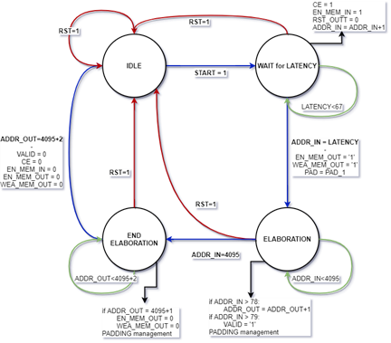

# PSD
Repository per il progetto di Progettazione dei Sistemi Digitali 2019/2020

Sviluppato da **_Andrea Alecce_** e **_Matteo Cannistrà_**

## Indice
1. [Schema a Blocchi](Schema-a-Blocchi)   
2. [Schema Vivado](Schema-Vivado)
3. [Schema Moltiplicatore Carta e Penna](Schema-Moltiplicatore-Carta-e-Penna)
4. [Schema Sommatore](Schema-Sommatore)
5. [FSM](FSM) 
6. [Smoothing](Smoothing) 
7. [Laplacian](Laplacian)
8. [Sobel](Sobel)

## Schema a Blocchi

## Schema Vivado

## Schema Moltiplicatore Carta e Penna

## Schema Sommatore

## FSM

## Smoothing

## Laplacian

## Sobel

